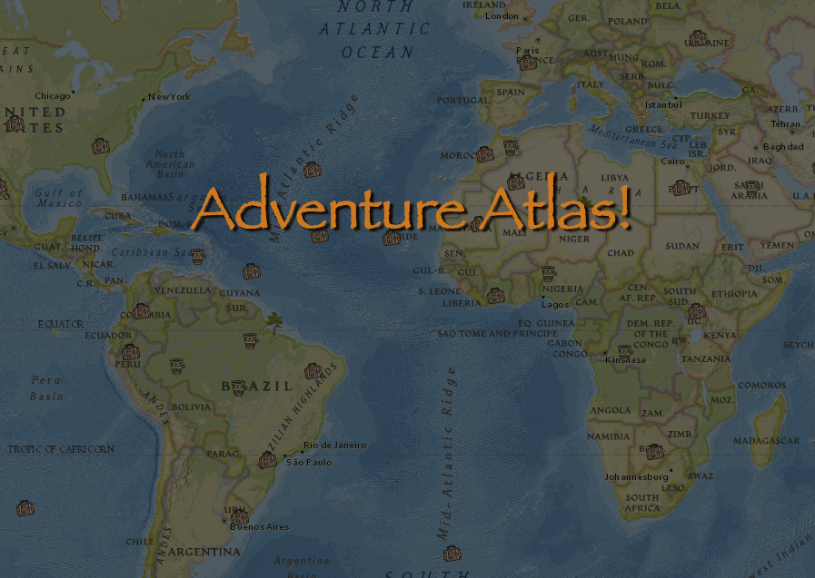

<div align="center">

# Adventure Atlas

</div>

<div align="center">


</div>
<h3 align="center">Created: 8.17.2021 | Last Updated: 8.18.2021</h3>
<h4 align="center"> By Adelaide Nalley</h4>

## Description

Adventure Atlas is a web app which allows users to view and post brief photo and text memories from travel adventures. Travel memories are set using point and click functionality on a nat geo-style map with accurate lat, long coordination. While viewers who sign up with name and password are able to add and delete their own entires, anyone is able to visit the website and view the shared memories.   

## Installation and Setup

1. Clone this repository: Open your terminal and use the command `git clone https://github.com/adiainthesky/adventureAtlas.git` into the directory you would like to clone the repository
2. Inside of terminal, navigate to project directory 
3. Install all required dependencies by running `npm install`
4. Set up a Google Cloud Firebase database to hold data and Google Cloud Storage to hold images.
5. Add a config.js file to store the credentials of the account you will be using for firebase. Put this file inside of the src file. See example below. 

```
module.exports = {
    import firebase from 'firebase/app';
import 'firebase/auth';
import 'firebase/storage';
import 'firebase/firestore';


const firebaseConfig = {
    apiKey: "YOUR_API_KEY",
    authDomain: "YOUR_PROJECT_ID.firebaseapp.com",
    projectId: "YOUR_PROJECT_ID",
    storageBucket: "YOUR_PROJECT_ID.appspot.com",
    messagingSenderId: "YOUR_SENDER_ID",
    appId: "YOUR_APP_ID"
};

const fire = firebase.initializeApp(firebaseConfig);
const projectStorage = firebase.storage();
const db = firebase.firestore();
const timestamp = firebase.firestore.FieldValue.serverTimestamp;

export { fire, projectStorage, db, timestamp };
}

```

## View In Browser

1. Inside of project directory, use the command `npm start` to run the application in development mode
2. This will launch a localhost:3000 in your browser and render the project's react front-end
3. Happy virtual travels!

## Known Bugs

On occasion, trip upload will not function if a prior attempt was unusccessful due to lack of attached img.  Clicking outside of popup and trying  again, or refreshing page solves issue.

## Support and Contact Details

If any errors or bugs occur please email, <adiainthesky@gmail.com>.

## Technologies Used

- CSS
- Firebase
- Firestore
- Git
- HTML
- JavaScript ES6
- JSX
- npm
- React-Leaflet
- React
- VSCode


### License

This software is licensed under the [MIT License](https://choosealicense.com/licenses/mit/).

Copyright (c) 2021 Adelaide Nalley